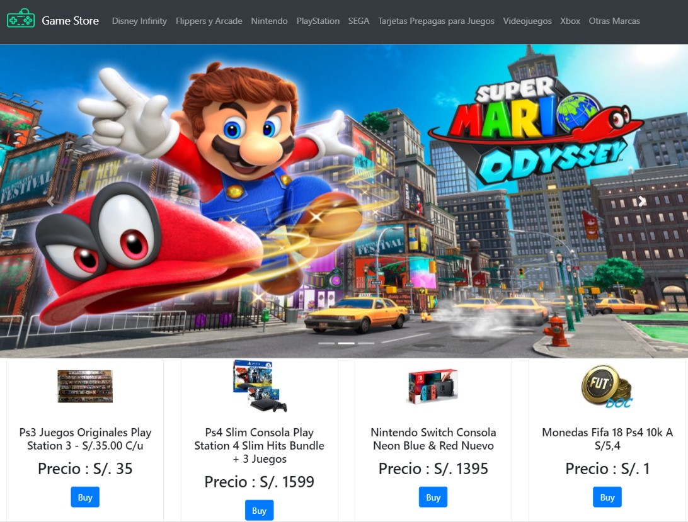
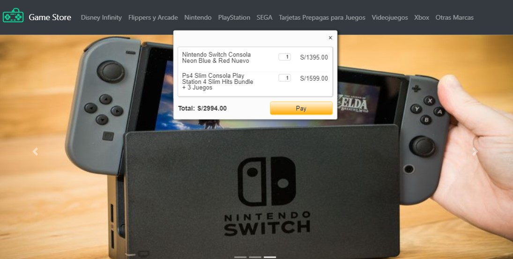
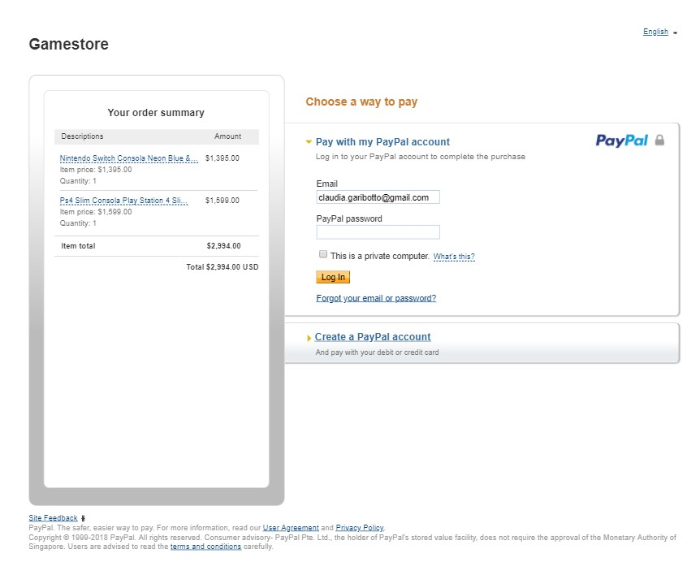

<h1  align="center">GAME STORE</h1>

</img>

E-commerce

##  **OBJETIVO**

Crear una Single-page Application con el API de Mercado libre y Paypal.

## **Desarrollo**
Se utilizó la Api de mercado libre para traer los productos según la categoria.

Al hacer click en comprar se habilita un modal con los productos que se desean.

Para finalizar el pago se redireccionara a la pasarela Paypal.

##  Tecnologias Usadas
- Jquery
- Bootstrap
- Javascript
- Html5
- Api de Mercado libre
- Paypal
- Ajax

## Autores

- **Carla Centeno** - [@carlacentenor](https://github.com/carlacentenor)
- **Claudia Garibotto** - [@claudiagari](https://github.com/claudiagari)

## Licencia

Este proyecto está licenciado bajo la Licencia ISC - ver el archivo [LICENSE](https://www.isc.org) para más detalles.

Copyright &copy; 2018 All Rights Reserved.