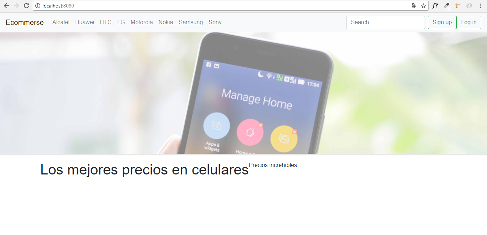

# E-commerce
***

## Objetivo:

* crear un Single Page Application haciendo uso de APIs de mercado libre y papal.

## Proceso
1. Delimitar el tema para crear el sitio web.
2. Hacer el diseño del sitio web e-commerce
3. Obtener la data de la API de mercado libre.

## Demo:

* Cuando seleccionas un de los item de la barra de navegación por ejemplo alcatel te mostrará lo siguiente: 

En la anterior imagen se puede observar que se cargaron todos los celulares del modelo alcatel, este proceso se realiza para los demás modelos de celulares.

