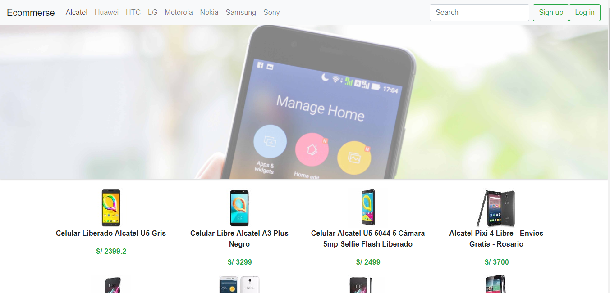

# E-commerce

### Objetivo:

* crear un Single Page Application haciendo uso de APIs de mercado libre y papal.




### Proceso

1. Delimitar el tema para crear el sitio web.
2. Hacer el diseño del sitio web e-commerce
3. Obtener la data de la API de mercado libre.

## Stack utilizado

- Node.js

- Express
[Express - Hello Wordl](http://expressjs.com/en/starter/hello-world.html)
[Express - Basic Routing](http://expressjs.com/en/starter/basic-routing.html)
[Express - Static Files](http://expressjs.com/en/starter/static-files.html)

- Jquery

- Ajax

## Comenzar con el proyecto

Para inicializar el proyecto debes tener node instalado, para correrlo en un servidor local, encontrarás un archivo `package.json`, donde se encuentran las dependencias y configuración. 
Para primero deberás instalar las dependecias con el comando.

```
npm install
```

Ahora debes instalar nodemon con el siguiente comando

```
npm install nodemon -g --save
```

Luego levantas el servidor a través de este comando

```
npm start
```

### Desarollado para

[Laboratoria](http://laboratoria.la)

#### Integrantes:
- Betsy Vidal
- Melyna Pernia
